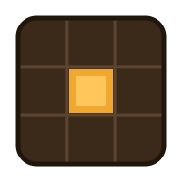

<p align="center">
  
</p>

# Slotify

**A design tool for Minecraft painted-GUI resource packs — pixel-perfect preview, glyph
registry, one-click deploy.**

*Guida completa in italiano: [GUIDA.md](GUIDA.md).*

## What is a painted GUI?

A trick most large Minecraft servers rely on: a vanilla chest inventory whose **title**
is a bitmap font glyph. The glyph is a full 256×256 sheet registered in
`assets/minecraft/font/gui.json`; a run of invisible negative-space characters walks the
title cursor left so the image lands behind the whole window, painting a completely
custom screen over a plain chest. Buttons are painted into the sheet; clicks are plain
slot indices.

It works beautifully and it fails silently. A wrong `ascent` draws the whole screen a
few pixels off with no warning in any log, ever. A single stray opaque pixel far to the
right of the artwork inflates the glyph's advance and drags every overlay across the
screen — invisible in an image viewer. Two providers claiming one codepoint means the
later one silently wins. Slotify exists to make every one of those numbers **measured,
checked and visible** instead of guessed.

## Status

The roadmap, each stage useful on its own:

- **v0 — Registry + Viewer** ✅: open a pack checkout, parse every font file, build the
  codepoint registry (collisions, dangling references, next-free allocation), browse
  every painted sheet with a pixel-perfect chest-window preview and live measurements
  (advance, stray pixels, implied vs declared ascent). Found three undocumented
  collisions in its first production pack on first run.
- **v1 — Editor + Export** ✅: touch-first canvas editor (place/drag/nudge slots,
  buttons, panels, wells in window coordinates — the ascent bakes at export, so it can
  never be "designed wrong"), hotspot painting on the slot grid, projects saved and
  reopened as JSON, import of existing screens with cell-detected hotspot suggestions;
  exports the PNG (stray-stripped, advance measured), an **idempotent textual splice**
  into `gui.json` (never re-serialised; verified byte-identical against a production
  file), and visuals/config YAML snippets.
- **v2 — Deploy + scaffold** ✅ *(mechanism)*: generates the server-side triplet
  (`<Name>Glyphs` with measured advances, `<Name>Layout` slot constants, a cursor-sim
  test), builds deploy plans (texture + spliced font, shown before anything is
  written), and runs `nexo reload pack` over RCON — from the dev bridge today, from the
  Rust side once packaged.
- **v3 — Text, colours & components** ✅: the pack's own bitmap font (`ascii.png`)
  rendered live — button labels, free text and infobox panels with editable fill, text
  and border colours; a **pixel tag generator** (gradient fill, outline, shadow,
  background plate → PNG or straight into the library); and an NXMenu-style **component
  library**: save any group of elements as a reusable composite, or import a PNG as a
  sprite, and place either with a tap — components live next to the pack
  (`tools/slotify/components/`) so every future screen starts from the same parts.
  Dragged elements edge-snap to each other; slots snap to the container grid.
- **v5 — States, paint, and where it runs** ✅: a screen can carry more than one
  state - each its own sheet, codepoint and Java constant, drawn over the base and
  sharing its window, so a second state costs a sheet instead of a second screen; the
  preview composes them through the title's real cursor arithmetic, and the export
  writes every sheet and splices every provider in one pass. A **paint** tool - brush,
  eraser, fill, line, rect, ellipse, recolour, with mirror, dither and pixel-perfect -
  puts a paint layer in the same element stack as everything else. The ascent grew a
  guard: artwork that falls off the 256 sheet is reported per state, with the room-above
  value that would fix it, instead of being cropped in silence. Ships as a Windows
  installer from CI and as a hosted browser build.
- **v4 — The editor as a tool you can work in** ✅: undo and redo over the whole
  project (snapshot-based, in `engine/history.ts`, coalesced so a drag is one step); a
  keyboard — arrows nudge, shift-arrows move a cell, duplicate, copy and paste layers
  between screens, digits pick tools, the wheel zooms; eight resize handles on the
  selection; ticked layers as a real multi-selection that drags, aligns, distributes
  and matches size (`engine/align.ts`); layer order, hide and lock. **Named colours**:
  a field holds `#RRGGBB` or `@brand.red` into a palette the profile carries and the
  project may shadow, so moving one swatch moves every screen that named it; plus an
  eyedropper, recent colours, a bevel-ramp preview and a contrast warning. The **plate**
  tool draws a button at any size off the 18px lattice, converting both ways, with
  single, double or flat edges, and text that aligns left, centre or right. An imported
  PNG can also serve as an onion skin to trace against. Drafts survive the window
  closing, exports back up what they overwrite and report how many pixels changed, and
  the profile is discovered rather than hard-coded — with its declared geometry checked
  against the engine's own constants.

- **v6 — Two languages, a real dialog, and designs** ✅: the whole interface reads in
  Italian or English, switched in the top bar and remembered per machine, with the copy
  rewritten short first (rules in [`src/i18n/README.md`](src/i18n/README.md)) rather than
  the old prose translated twice. A light and a dark theme, a spacing scale, and a tool
  rail of icons instead of twelve words. Rails are collapsible panels that stay useful
  shut, so the right-hand column stopped being a scroll of twelve open cards. **Button
  designs**: a named look — bevel depth plus square, cut or rounded corners, or an
  imported ninepatch PNG — picked from a gallery whose thumbnails are drawn by the same
  code that draws the button. The component library became a wall of thumbnails with a
  search box, because a library of drawings listed by name tells you nothing about any of
  them. Almost everything on the canvas is a **drag** now — a four-cell button, a row of
  slots, a run of covered slots, a block of cut ones — each one gesture and one undo. And
  a carved hole **frames itself from the inside**: the border comes out of the space the
  cut removed, so every slot around it keeps its whole ring. Anything ticked can be
  **flattened** into the library as one cropped PNG, which is how hand-painted work
  becomes a reusable piece instead of a base64 blob in a JSON file. Infobox text clears
  the box's border by three pixels rather than sitting on it.

- **v7 — Containers, measured** ✅: geometry stopped being the chest. A `ContainerProfile`
  carries a screen's window, slots and viewer inventory, and **nothing in it is typed by
  hand**. **Import from Minecraft** reads a client jar and measures every container screen
  in it — anvil, furnace, brewing stand, villager, all of them — because a vanilla slot
  well has an exact pixel signature; the textures are measured and dropped, so nothing of
  Mojang's is written into anybody's pack. What cannot be detected is where the client
  draws the *title*, which lives in client code: that is **calibrated by dropping a
  screenshot in**. Slotify finds the window by the slot grid it already measured, finds
  the marker because it is magenta, works out the GUI scale from the two of them and
  solves — nothing typed. A measured container is ready to draw on straight away; the
  calibration is only needed to export. Where the rest of this is going:
  [SLOTIFY-VISION.md](SLOTIFY-VISION.md).

## Getting it

- **Desktop (Windows)** — the installer is attached to each [GitHub
  Release](https://github.com/giovyx90/Slotify/releases). Tagging `v*` builds it on CI
  and publishes it there; the binary never enters the repository, where a 6 MB installer
  per version would stay in every clone forever.
- **In a browser, no install** — the same build hosted on Vercel. It reaches a real pack
  checkout through the File System Access API: the folder you hand over, and nothing
  else. Chromium only (Chrome, Edge, Opera), and the RCON push stays a desktop feature
  because no page may open a TCP socket.

## Using it

1. `npm run dev`, open `localhost:1420` (or the packaged app once built).
2. The **viewer** lists every painted sheet in the pack with collisions flagged; pick
   one to see measurements, or **Open in editor** to start from it.
3. **+ New screen** asks what the screen is called — module, screen key, codepoint and
   rows — and shows the project file and the texture path those two names produce
   before you commit to them. It starts blank. Buttons and infoboxes are **connectable tiles**: tap
   a grid cell for a 1×1 piece, tap the next cell and it grows into one merged piece —
   the bevel wraps the region outline, and recolouring hue-shifts the highlights and
   shadows instead of leaving them white and black. The **erase** tool removes (and
   restores) individual container or player-inventory slots. Free elements
   (slot/text/panel/well) place with a tap, drag with edge snapping, and refine with
   the 1px nudge pad. Infoboxes render the profile's own artist texture as a ninepatch,
   with a colour per line; all text can use the pack font or the built-in 5×5 mono,
   with an optional directional shadow. Paint hotspots by tapping slots with a group
   active.
4. **Library**: check some layers, name them, *save ✓* — or *Import PNG…*, which opens
   the platform's own file dialog — then tap any library entry and tap the canvas to
   place it. *Reference* imports a PNG as an onion skin drawn over the artwork; it is
   never exported.
5. **Tag generator**, the second tab in the top bar, renders styled game-font text;
   download it or save it to the library as a sprite.
6. **Export to pack** — in the editor's top bar, next to **Save project** — writes the
   stray-stripped PNG and splices the provider into `gui.json`; the *Copy out* card hands
   you the visuals/config YAML and the Java scaffold. **Push** writes a deploy plan under
   a target pack path and runs `nexo reload pack` over RCON.

## Keys

Everything is ignored while a text field has focus, where these keys already mean
something else.

| Key | Does |
|---|---|
| arrows / shift+arrows | Nudge the selection 1px / one 18px cell |
| `ctrl+Z`, `ctrl+shift+Z` | Undo, redo |
| `ctrl+D`, `ctrl+C`, `ctrl+V` | Duplicate; copy and paste layers, across screens too |
| `ctrl+A`, `ctrl+S` | Tick every layer; save the project |
| `Delete`, `Escape` | Delete the selection; drop the tool and the selection |
| `1`…`9`, `0` | Pick a tool, in palette order |
| `+` / `-`, wheel | Zoom |
| `g`, `n` | Guides; raw slot numbers |
| drag / shift+drag with `erase` | Cut a run of regions; cut a rectangle of them |

## The interface

Slotify wears the [NEXT Roleplay](https://nextroleplay.gg) portal's design language:
its red, its ink ramp, Archivo for prose and IBM Plex Mono for every number a machine
measured. A painted screen is designed here and documented there, so the two should not
look like they came from different studios.

There are two themes. Light is the portal's paper-white; dark exists because this is a
pixel-art tool used at night and against dark artwork, and a checkerboard that means
*transparent* has to read as a surface rather than as a light. `auto` follows the
system. The choice, and the language, live in `localStorage` beside the last pack you
opened — never in the profile, which belongs to the pack and to everyone who checks it
out.

The whole skin is one file, [`src/ui/theme.css`](src/ui/theme.css) — tokens and a small
set of primitives (card, button, segmented control, field, badge, checkerboard stage)
that the three screens share instead of each growing its own. Retheming Slotify for
another project means editing the tokens at the top of that file and nothing else. The
two faces are bundled under the SIL OFL rather than fetched from a CDN, because a
desktop tool has to look the same with no network; see
[`src/ui/fonts/README.md`](src/ui/fonts/README.md).

## Generic engine, per-project profiles

The engine knows the *mechanics* — font providers, cursor arithmetic, slot geometry,
measurement. Everything project-specific (paths, codepoint ranges per module, palette,
deploy targets) lives in a **profile** JSON you keep next to your pack. See
[`profiles/example.profile.json`](profiles/example.profile.json).

**A pack with no profile at all still opens.** The layout is inferred from the folder —
fonts at the root, one directory per category, or categories under a container — and the
guess is shown rather than hidden, with a button to write it down. Verified against the
NEXT monorepo: the inference reproduces its hand-written profile exactly. An empty folder
opens too, because that is a pack about to be started.

The profile is discovered, not configured: `slotify.profile.json` at the repository
root, then `tools/slotify/next.profile.json`, then any `*.profile.json` under
`tools/slotify` or `profiles` — never a `*.local.json`. Machine-local values (absolute
paths, hosts) belong in that gitignored `*.profile.local.json`; credentials never belong
in any file — the deploy adapter will use the OS keychain.

A profile's `geometry` and `spacers` blocks are *checked*, not obeyed: the engine's
constants are derived from a measured production screen, and a profile that disagrees
is reported on load while the engine still wins. The `palette` block is the pack's
named colours, offered in every colour field and referenced from projects as `@id`.

## Development

```bash
npm install
npm test          # engine unit tests (no pack needed)
npm run dev       # browser dev server on :1420
```

To browse a real pack in the browser dev server, copy
[`slotify.dev.example.json`](slotify.dev.example.json) to `slotify.dev.json` and point a
root at your pack checkout. The packaged desktop app (Tauri v2) needs a Rust toolchain:
`npm run tauri dev`.

Golden tests that re-measure a real production pack are gated on the
`SLOTIFY_NEXT_REPO` environment variable and skip cleanly without it.

## License

[GPL-3.0-or-later](LICENSE).
